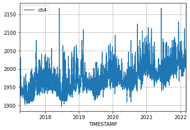
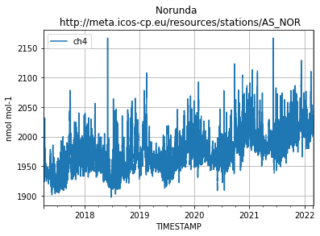

# Examples

The following paragraphs explain how to use the library in worked examples. If you would like to run the library live and play around with data sets without installation: We have a public Jupyter Hub running Python3 notebooks, where the library is preinstalled. There you will find several examples in the folder `pylib_examples`

[https://exploredata.icos-cp.eu/](https://exploredata.icos-cp.eu/)

user: name@organisation  
password: get in touch to get the password

## Digital Object

For the example below, we assume that you know how to get hold of the PID/URI used at the Carbon Portal. You can read more about this in the Modules section. Each object in the data portal has a unique and persistent identification in form of an URI. The following examples will use the URI 

[https://meta.icos-cp.eu/objects/lNJPHqvsMuTAh-3DOvJejgYc](https://meta.icos-cp.eu/objects/lNJPHqvsMuTAh-3DOvJejgYc)

which is an ICOS Atmosphere Level 2 data set from Norunda, release 2019-1. Go to the landing page to find more information about this data set.

### Data Object

	from icoscp.cpb.dobj import Dobj
	dobj = Dobj('https://meta.icos-cp.eu/objects/lNJPHqvsMuTAh-3DOvJejgYc')
	
Information (meta data) is automatically stored in a dictionary (the `json`-file from the landing page) with the object, accessible with `Dobj.meta`. More about the content of meta and other attributes are in the [modules section](modules.md#dobjinfo). Common used properties are as well available directly. Following are a few examples:
	
	dobj.colNames
	
['TIMESTAMP', 'Flag', 'NbPoints', 'ch4', 'Stdev']

or get the citation string for this object:
	
	dobj.citation
	
"Lehner, I., Mölder, M., ICOS RI, 2019. ICOS ATC CH4 Release, Norunda (59.0 m), 2017-04-01–2019-04-30, https://hdl.handle.net/11676/lNJPHqvsMuTAh-3DOvJejgYc"

### DataFrame

Extracting the data as pandas data frame:

	from icoscp.cpb.dobj import Dobj

	uri = 'https://meta.icos-cp.eu/objects/lNJPHqvsMuTAh-3DOvJejgYc'
	dobj = Dobj(uri)
	if dobj.valid:
		display(dobj.data.head(10))
	else:
		print('no preview data available')
	
Printing the first 10 rows of the data (`data.head(10)`) should yield the following table:

id |  Flag |  NbPoints | Stdev  |           TIMESTAMP |          ch4
-- | ----- | --------- | ------ |---------------------| ------------
0  |     N |         0 | -9.990 | 2017-04-01 00:00:00 |          NaN
1  |     N |         0 | -9.990 | 2017-04-01 01:00:00 |          NaN
2  |     O |         9 |  0.079 | 2017-04-01 02:00:00 |  1948.660034
3  |     O |        16 |  1.070 | 2017-04-01 03:00:00 |  1950.900024
4  |     O |        17 |  0.817 | 2017-04-01 04:00:00 |  1953.229980
5  |     O |        16 |  0.271 | 2017-04-01 05:00:00 |  1956.319946
6  |     O |        16 |  0.590 | 2017-04-01 06:00:00 |  1957.810059
7  |     O |        16 |  0.736 | 2017-04-01 07:00:00 |  1960.550049
8  |     O |        16 |  0.429 | 2017-04-01 08:00:00 |  1962.540039
9  |     O |        17 |  0.861 | 2017-04-01 09:00:00 |  1965.349976

### Minimalistic Plot

This first example shows how to extract a data file and create a plot. It is the easiest way to load the data into a Pandas DataFrame in your Python environment. The DataFrame contains the following columNames:
Flag, NbPoints, Stdev, TIMESTAMP, ch4. Let's load the data and create a plot for measured methane concentrations over time.

	from icoscp.cpb.dobj import Dobj

	pid = 'https://meta.icos-cp.eu/objects/lNJPHqvsMuTAh-3DOvJejgYc'
	dobj = Dobj(pid)
	dobj.data.plot(x='TIMESTAMP', y='ch4', grid=True)

### Plot with Title and Units
To get a useful plot, at the very least we should have a title and the unit of measurement:

	import matplotlib.pyplot as plt
	from icoscp.cpb.dobj import Dobj
	
	pid = 'https://meta.icos-cp.eu/objects/lNJPHqvsMuTAh-3DOvJejgYc'
	dobj = Dobj(pid)
	

	# Extract information from the dobj meta data.
	# Look at dobj.meta for a full list of metadata.
	unit = dobj.variables[dobj.variables.name == 'ch4'].unit.values[0]
	name = dobj.station['org']['name']
	uri = dobj.station['org']['self']['uri']
	title = f"{name} \n {uri}"

	plot = dobj.data.plot(x='TIMESTAMP', y='ch4', grid=True, title=title)
	plot.set(ylabel=unit)

	plt.show()
	

## Stations

### Station Id's

The function to get the station id's might be something you will use a lot. Based on a station id you can get all the dobj id's (PID/URI) and hence access to the data. So if you have no idea whatsoever what stations are available, you came to the right place:

	from icoscp.station import station

	stationList = station.getIdList()  # Returns a Pandas DataFrame.
	stationList.columns  # What information do we get back?	

Index(['uri', 'id', 'name', 'country', 'lat', 'lon', 'elevation', 'project',
       'theme'],
      dtype='object')
	
	stationList.head(5)

uri |   id    |                         name |...| project | theme |
--- | ------- | ---------------------------- |---| ------- | ----- |
... |  SE-Sto |   Abisko-Stordalen Palsa Bog |...|    ICOS |   ES  |
... |  IT-Noe | Arca di Noe - Le Prigionette |...|    ICOS |   ES  |
... |  UK-AMo |             Auchencorth Moss |...|    ICOS |   ES  |
... |  FR-Aur |                       Aurade |...|    ICOS |   ES  |
... |    11BE |              BE-SOOP-Belgica |...|    ICOS |   OS  |

 
Now you have basic information about a station, but most important you got the station id as well. NOTE: to create a station object you need to provide the station id as is **CaseSensitiv**

### A station Object
Let's create a station object and have a look what information is provided with the function .info() . Each entry from "info" is an attribute and can be extracted with "myStation.attribute". In the following example you can access the station name with myStation.name

	from icoscp.station import station

	myStation = station.get('SE-Nor')
	myStation.info()
	
{
'stationId': 'SE-Nor', 
'name': 'Norunda', 
'theme': 'ES', 
'icosclass': '2', 
'siteType': 'Forest', 
'lat': 60.0865, 
'lon': 17.4795, 
'eas': None, 
'firstName': 'Meelis', 
'lastName': 'Mölder', 
'email': 'meelis.molder@nateko.lu.se', 
'country': 'SE', 
'project': ['ICOS'], 
'uri': ['http://meta.icos-cp.eu/resources/stations/ES_SE-Nor']} 

	myStation.products() # Return DataFrame with all products available from this station.

id |                           specification     |
---|---------------------------------------------|
0  |               Drought 2018 Archive Product  |
1  |  Ecosystem meteo time series (ICOS Sweden)  |
2  | Ecosystem fluxes time series (ICOS Sweden)  |
3  |    Ecosystem eco time series (ICOS Sweden)  |
4  |               Drought 2018 FLUXNET Product  |
5  |                  ICOS ETC Archive Product   |
6  |                   ICOS ETC FLUXNET Product  |

 
 
All the dobj URI's (ultimately containing the data itself) can be retrieved with "myStation.data()"
let see what columns are provided. The most important information will be the 'dobj' column. This contains the link to the data and can be used to extract the data.

	from icoscp.station import station

	myStation = station.get('SE-Nor')
	myStation.data().columns
	
Index(['station', 'dobj', 'spec', 'timeStart', 'timeEnd', 'specLabel',
       'samplingheight', 'datalevel', 'bytes'],
      dtype='object')

	myStation.data(level='2') # Return a DataFrame with Level 2 data objects for the station.

station               |  dobj                                                    |  spec
----------------------|----------------------------------------------------------|-------------------------------
...stations/ES_SE-Nor | https://meta.icos-cp.eu/objects/KfJjYyksI2nxCiJU36UfYVY_ | .../dought2018ArchiveProduct
...stations/ES_SE-Nor | https://meta.icos-cp.eu/objects/L-in6TpOcGjmXruwi3ESD9G2 | .../drought2018FluxnetProduct
...stations/ES_SE-Nor | https://meta.icos-cp.eu/objects/mBPKiB9tIQZQGrsy8ehAinvz | .../etcArchiveProduct
...stations/ES_SE-Nor | https://meta.icos-cp.eu/objects/XA_Ifq7BKqS0tkQd4dGVEFnM | .../etcFluxnetProduct

This is not the full output, just an excerpt.

### List of Stations
There is a built in function to extract a list of stations. Be aware that if you extract all ICOS stations, a lot of information is gathered and retrieved. At the time of writing there are over a 100 stations and in can take up to a minute to extract all.

	from icoscp.station import station

	icosStations = station.getList()	
	for s in icosStations:
		print(s.stationId, s.name, s.lat, s.lon)

SE-Sto Abisko-Stordalen Palsa Bog 68.35596 19.04521  
IT-Noe Arca di Noe - Le Prigionette 40.60617 8.15117  
UK-AMo Auchencorth Moss 55.7925 -3.24362  
FR-Aur Aurade 43.54965 1.106103  
...

## Collections

### Find a collection

	from icoscp.collection import collection

	collection.getIdList()

Output is a pandas data frame, where each row contains information about a collection. The column `collection` or `doi` can be used to create a collection representation. The column `dobj` contains a list of all associated digital objects (the data) and the column `count` tells you how many data files are associated.

collection | doi | title | description | dobj | count 
-----------|-----|-------|-------------|------|-------
https://meta.icos-cp.eu/collections/WM5ShdLFqP...|10.18160/P7E9-EKEA|Ambient atmospheric methane observations from ...|This dataset for historic ambient CH4 mole fra...|[https://meta.icos-cp.eu/objects/pWqX-lRUsilS_...|30

 
### Create a collection representation
with the information from above, you can use either the `collection` or `doi` to initialize a collection representation and print some information. Have a look at [Modules / collection](modules.md#collection) for a full list of attributes.

	myCollection = collection.get('10.18160/P7E9-EKEA')
	myCollection.info()

{'id': 'https://meta.icos-cp.eu/collections/WM5ShdLFqPSI0coyVa57G1_Z',
 'doi': '10.18160/P7E9-EKEA',
 'citation': 'Integrated Non-CO2 Observing System (INGOS). (2018). Ambient atmospheric methane observations from the ICOS/InGOS network 2000-2015. ICOS ERIC - Carbon Portal. https://doi.org/10.18160/P7E9-EKEA\n',
 'title': 'Ambient atmospheric methane observations from the ICOS/InGOS network 2000-2015',
 'description': 'This dataset for historic ambient CH4 mole fractions is an important outcome of the FP7 InGOS project (http://www.ingos-infrastructure.eu, Grant Agreement Number 284274). Data from 17 stations have been reprocessed for the period 2000-2015; in some cases involving re-integration of chromatograms and in all cases re-calibrating the time series using updated assigned values for standard gases and target gases. All data have been brought to the same concentration scale (NOAA-2006A). Data have been flagged for identified periods with instrumental or sampling problems. Next to added estimations for measurement uncertainty based on repeatability of the working standards also error estimates are added that represent uncertainty due to lab internal scale consistency, monthly reproducibility, scale transfer and where available comparison with concurrent flask sampling.'}

 
A more in depth example and how to plot data from the collection can be found on [https://exploredata.icos-cp.eu](https://exploredata.icos-cp.eu)

